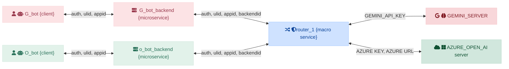

## G - bot & O -bot flow diagram 

```mermaid
flowchart LR
    GClient["fa:fa-user fa:fa-robot G_bot {client}"]:::pinkLightStyle
    GBackend["fa:fa-server  G_bot_backend {microservice}"]:::pinkLightStyle
    OClient["fa:fa-user fa:fa-robot O_bot {client}"]:::greenLightStyle
    OBackend["fa:fa-server o_bot_backend {microservice}"]:::greenLightStyle
    
    Router["fa:fa-random <i class="fa-solid fa-shield-halved"></i>router_1 {macro service}"]:::blueStyle
    Gemini["fab:fa-google fa:fa-brain  GEMINI_SERVER"]:::pinkStyle
    Azure["fa:fa-cloud fab:fa-microsoft AZURE_OPEN_AI server"]:::greenStyle
    

    GClient <-->|auth, ulid, appid| GBackend
    OClient <--> |auth, ulid, appid| OBackend
    
    GBackend <-->|auth, ulid, appid, backendid| Router
    OBackend <--> |auth, ulid, appid, backendid| Router
    
    Router <-->|GEMINI_API_KEY| Gemini
    Router <-->|AZURE KEY, AZURE URL| Azure

  
    
    classDef pinkStyle fill:#f8d7da,stroke:#f5c2c7,color:#842029
    classDef pinkLightStyle fill:#fce3e5,stroke:#f8d7da,color:#99394d
    classDef greenStyle fill:#d1e7dd,stroke:#badbcc,color:#0f5132
    classDef yellowStyle fill:#fffacd,stroke:#ffe4c4,color:#b8860b
    classDef greenLightStyle fill:#e2f2ea,stroke:#d1e7dd,color:#2a725a
    classDef blueStyle fill:#cfe2ff,stroke:#9ec5fe,color:#084298


```
